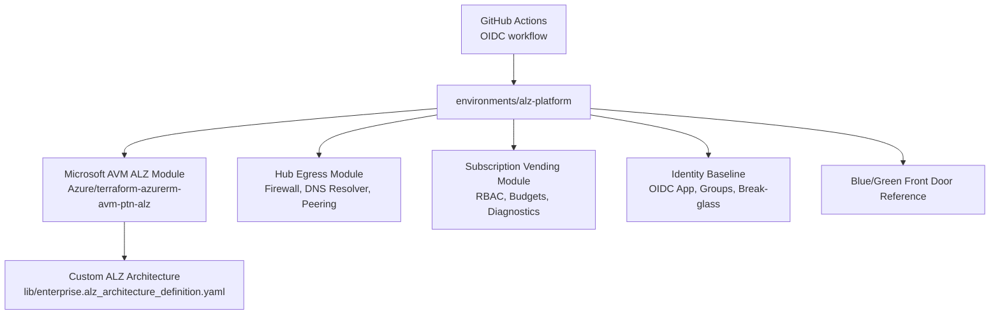
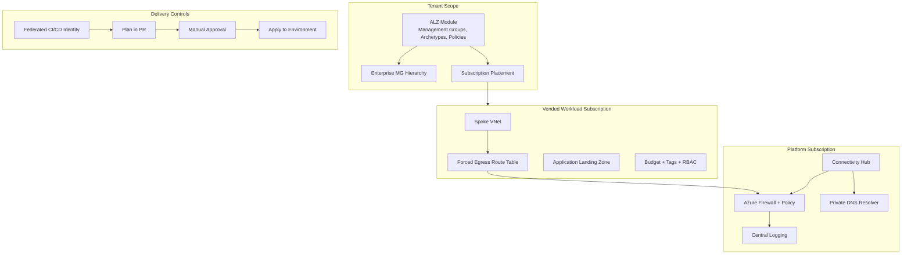
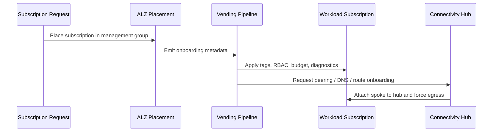
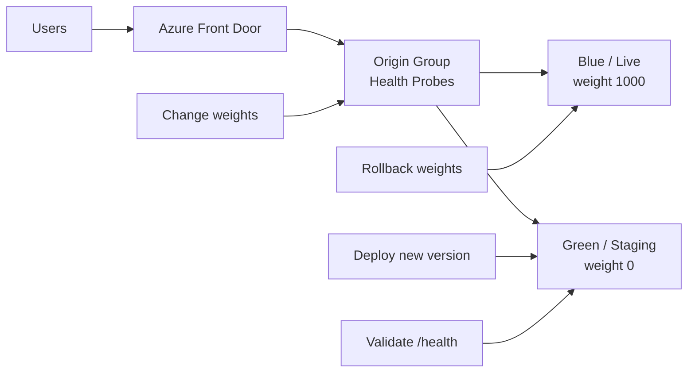
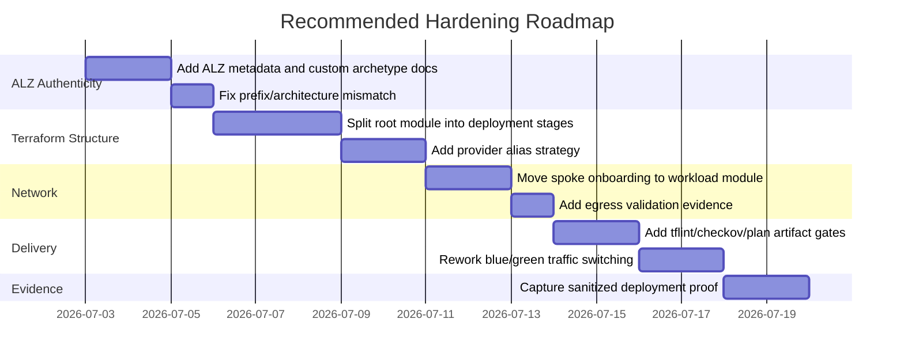

# Azure ALZ Accelerator Lab Review

## Executive Summary

This repo is a strong step in the right direction. It does the most important positioning work: it moves away from a purely custom landing-zone build and starts using the Microsoft ALZ Terraform module and ALZ library model.

That said, I would not present the repo as production-ready yet. I would describe it as a credible ALZ Accelerator lab or implementation scaffold. The architecture story is good, but a few Terraform details need to be tightened before a sharp Azure reviewer would accept it as deployable.

The main recommendations are:

- Make the ALZ library implementation more authentic and testable.
- Fix the hard-coded `contoso` hierarchy so the `prefix` variable cannot break the deployment.
- Separate tenant-level ALZ deployment from subscription-level platform deployment.
- Rework hub/spoke egress for multi-subscription provider aliases.
- Turn subscription vending into an end-to-end workflow with state, placement, RBAC, budgets, diagnostics, and onboarding outputs.
- Make the blue/green example a real traffic-switching pattern.
- Treat PIM and break-glass as architecture controls, not just role assignments.

## Current Architecture



This is the right shape for a portfolio repo. The next step is to make the boundaries cleaner and the Terraform more operationally accurate.

## Target Architecture



## Priority Recommendations

### 1. Make the ALZ custom library complete

The repo references a custom library path in [providers.tf](../environments/alz-platform/providers.tf):

```hcl
custom_url = "${path.root}/../../lib"
```

The custom architecture file exists, but the repo does not include an `alz_library_metadata.json` file or custom archetype definitions. That may work only if the provider accepts the architecture file directly alongside the platform library. I would not leave that ambiguous.

Recommendation:

- Add `lib/alz_library_metadata.json`.
- Add a short `lib/README.md` explaining which archetypes come from the Microsoft platform library and which are custom.
- If `decommissioned`, `vendor`, or `saas` behavior needs special policies, create custom archetype files instead of only reusing `corp` and `online`.
- Add a validation note showing the ALZ provider can discover `enterprise.alz_architecture_definition.yaml`.

Why it matters:

The client asked for ALZ Accelerator experience. The library/archetype layer is where that experience becomes visible.

### 2. Remove the hard-coded `contoso` mismatch

The platform module uses `var.prefix` when it references ALZ outputs:

- [main.tf](../environments/alz-platform/main.tf), line 62: `module.alz.management_group_resource_ids["${var.prefix}-alz"]`
- [main.tf](../environments/alz-platform/main.tf), line 22: `"${var.prefix}-sandbox"`

But the ALZ architecture definition hard-codes `contoso-*` IDs:

- [enterprise.alz_architecture_definition.yaml](../lib/enterprise.alz_architecture_definition.yaml), line 4: `contoso-alz`
- line 88: `contoso-sandbox`

If `prefix` is changed to anything other than `contoso`, the output lookup and hierarchy setting will not line up with the architecture file.

Recommendation:

- Either lock `prefix = "contoso"` and document that this is a fixed lab tenant, or
- Convert the architecture definition into a template generated from `var.prefix`, or
- Rename the variable from `prefix` to `enterprise_id` and make it clear it must match the architecture IDs.

My preference:

Use a generated architecture file per environment. That proves you understand reusable ALZ architecture definitions.

### 3. Split tenant-level ALZ from subscription-level resources

Right now [main.tf](../environments/alz-platform/main.tf) deploys tenant-scope ALZ, connectivity resources, identity objects, subscription controls, and Front Door from one root module.

That is convenient for a lab, but not how I would run this for an enterprise.

Recommendation:

Split the repo into stages:

```text
environments/
  00-bootstrap-state/
  01-alz-tenant/
  02-connectivity/
  03-management/
  04-subscription-vending/
  05-workload-reference/
```

Why it matters:

- Tenant-scope ALZ changes should be rare and heavily reviewed.
- Connectivity changes need network-team ownership.
- Subscription vending should run repeatedly.
- Workload references should not be coupled to the tenant root deployment.

### 4. Fix multi-subscription provider strategy

The repo accepts multiple workload subscriptions, but the root provider only configures one AzureRM subscription:

- [providers.tf](../environments/alz-platform/providers.tf), line 30: `subscription_id = var.platform_subscription_id`

That means resources intended for workload subscriptions may still try to deploy through the platform subscription provider context.

Examples:

- Subscription-level RBAC in [subscription-vending/main.tf](../modules/subscription-vending/main.tf), lines 34-52
- Budgets in lines 55-82
- Diagnostic settings in lines 84-102
- Route tables in lines 104-120

Recommendation:

- Use `azapi` for subscription-scope operations where possible.
- For known subscriptions, use explicit provider aliases.
- For vending at scale, separate subscription creation/placement from per-subscription baseline deployment.
- Consider a generated stack or pipeline matrix: one apply per vended subscription.

Example target flow:



### 5. Rework hub-spoke onboarding for real cross-subscription networking

The hub egress module has the right intent: firewall, DNS resolver, route table, peering, and forced egress. The issue is operational ownership.

The module tries to manage both hub and spoke peerings from the same provider context:

- [hub-egress/main.tf](../modules/hub-egress/main.tf), lines 155-177

That can work only if the identity and provider context have rights to both hub and spoke subscriptions. In a real enterprise, connectivity and workload subscriptions are usually separate ownership domains.

Recommendation:

- Keep hub resources in the connectivity subscription.
- Move spoke peering and subnet route table association into a workload onboarding module.
- Use provider aliases or pipeline stages for each subscription.
- Add explicit validation that spoke subnets have no direct internet path except Azure Firewall.

Also consider:

- Add Azure Firewall diagnostics for policy rule collection groups and DNS proxy logs.
- Add Network Watcher flow logs or NSG flow logs where supported.
- Add UDRs for private ranges if inspection between spokes is required.
- Decide whether `allow_gateway_transit = true` should be conditional, especially if ExpressRoute/VPN is not implemented yet.

### 6. Do not create route tables in subscription vending without owning the network resource group

The subscription vending module creates route tables in a guessed resource group:

- [subscription-vending/main.tf](../modules/subscription-vending/main.tf), line 112: `rg-${each.key}-network`
- line 111 hard-codes `eastus`

That is too brittle. A vending module should not assume the workload network resource group already exists with a naming convention unless it also creates it.

Recommendation:

- Remove route table creation from subscription vending, or
- Add explicit `network_resource_group_name`, `location`, and `subnet_ids` inputs, or
- Move route-table creation into a workload network module.

Better pattern:

```text
subscription-vending:
  - subscription placement
  - RBAC
  - budget
  - tags
  - diagnostics
  - onboarding outputs

workload-network-onboarding:
  - spoke VNet
  - peerings
  - subnet route table association
  - private DNS links
```

### 7. Make blue/green an actual switchable pattern

The Front Door module creates blue and green origin groups, but the route only points to blue:

- [blue-green-frontdoor/main.tf](../modules/blue-green-frontdoor/main.tf), lines 89-101

The green origin exists but is not actually part of the live route. Setting green weight to zero does not matter if green is in a different origin group that the route does not use.

Recommendation:

- Use one origin group containing both blue and green origins, with weights.
- Or use two routes/domains and document promotion as a route swap.
- Add variables for `blue_weight` and `green_weight`.
- Add a rollback example.

Target model:



### 8. Strengthen identity and privileged access

The identity module demonstrates GitHub OIDC and role assignments, which is good. The risk is that the current model assigns broad active roles:

- [identity-baseline/main.tf](../modules/identity-baseline/main.tf), lines 24-42

Recommendation:

- Keep the federated deployment identity, but scope it to the minimum required roles.
- Move human admin roles toward PIM-eligible assignments.
- Add a Conditional Access design note for break-glass accounts.
- Add monitoring requirements for emergency access sign-ins.
- Add a role assignment matrix in the README.

Suggested matrix:

| Principal | Scope | Access Model | Notes |
| --- | --- | --- | --- |
| Platform deployment identity | ALZ root / platform scopes | Active, least privilege | Used by GitHub OIDC |
| Platform admins | ALZ root | PIM eligible | Human admin access |
| Security readers | Tenant / management groups | Active reader | Continuous visibility |
| Break-glass users | Tenant root | Active emergency access | Cloud-only, monitored |

### 9. Add real CI quality gates

The workflow runs fmt, validate, and plan. That is a good start.

Recommendation:

- Add `terraform plan -detailed-exitcode`.
- Upload the plan artifact.
- Add `tflint`.
- Add `tfsec` or Checkov.
- Add a step that fails if `.alzlib` is committed.
- Add a pull request summary with the plan result.
- Split plan and apply so the apply job uses the reviewed plan artifact, not a fresh unreviewed apply.

Current workflow issue:

The apply job runs `terraform apply -auto-approve` without applying a saved plan from the approved plan job. For regulated environments, that weakens the approval story.

### 10. Add evidence outputs

The repo has good documentation, but it needs evidence once deployed.

Recommendation:

Add:

```text
evidence/
  management-groups.md
  policy-assignments.md
  subscription-placement.md
  hub-egress.md
  github-oidc.md
  blue-green.md
```

Each file should include sanitized CLI output. This will make the repo much stronger in interviews because it shows the design was actually tested.

## Recommended Roadmap



## How I Would Describe This Repo Today

Use this language:

> This is an ALZ Accelerator-oriented Terraform lab that uses the Microsoft AVM ALZ module, custom ALZ architecture definitions, subscription placement, hub-controlled egress patterns, identity federation, and CI/CD scaffolding. It is currently a portfolio implementation scaffold, and the next hardening step is to validate the ALZ library, split tenant and subscription deployments, add provider aliases for multi-subscription operations, and capture deployment evidence.

Avoid saying:

> This is a production-ready Azure Landing Zone.

That claim is too strong until the repo has been validated against a real tenant and the multi-subscription/provider model is corrected.

## Bottom Line

The repo is credible and directionally strong. It shows the right instincts and the right Microsoft ALZ module direction. The next round should focus less on adding more Azure services and more on making the deployment model real: ALZ library validation, staged deployments, provider boundaries, subscription onboarding, traffic switching, and evidence.

